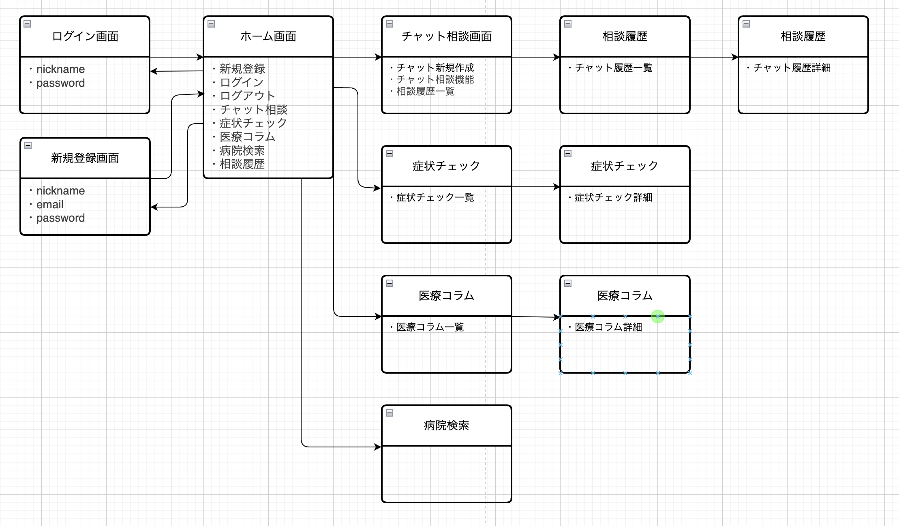

# アプリケーション名
Hanaso

---

## アプリケーション概要
子育て中の保護者が、子どもの体調や育児の不安について気軽に相談できるチャットアプリです。  
AIは病名診断は行わず、入力された症状や状況に応じて受診の必要性や緊急度を案内します。  
また、情報が不足している場合は追加情報の入力を促し、誤った判断を避けるよう設計しています。

本アプリが提供するユーザー体験として特に大切にしているのは、以下の4点です。  
1. **聞いてもらえた、わかってもらえた**という共感  
2. **安心感を得られ、心が軽くなる**こと  
3. **正しい情報に基づいたアドバイス**をもとに冷静に対応できること  
4. **いつでも気軽に相談できる**環境の提供

---

## アプリケーションを作成した背景
30代共働きで子育て中の母親をターゲットに、育児の孤立感や医療アクセスの不安を軽減するために作成しました。  
特に「病院に行くべきか迷う」という場面で、症状や状況に応じた受診判断の目安を提供します。  
病名診断は行わず、情報不足の場合は追加の質問を行い、可能な限り正確かつ安全な案内を行うことを重視しています。

また、受診判断だけでなく、以下のような**日常の些細な相談事**も想定しています。  
- 発育や発達に関する悩み  
- 子どもへの接し方や対応に迷ったとき  

以前は自分の母親や友人、近所の人に気軽に相談できていたことも、核家族化や共働きの増加により、相談できる相手がいない環境が増えています。  
その結果、孤独感を抱えながら育児をしている人が多いと感じています。  

実際の医療現場でも、些細なことでも相談できたことで安心し、笑顔で帰る人が少なくありません。  
このアプリもまた、そんな「気軽に話せて安心できる場所」として役立つ存在でありたいと考えています。

---

## URL
https://hanaso.onrender.com

---

## テスト用アカウント
- メールアドレス: test@example.com
- パスワード: password123
- Basic認証ID: admin
- Basic認証パスワード: 2222

# 管理者アカウント
- メールアドレス: admin@example.com
- パスワード: password

---

## 利用方法
1. トップページから相談するボタンをクリックし、新しいチャットスレッドを作成
2. メッセージ入力欄に相談内容を入力し、送信ボタン（↑）またはEnterキーで送信
3. AIからの返信を確認し、必要に応じてやり取りを継続
4. 過去のチャット履歴は「スレッド一覧」から確認・再開が可能
5. 症状チェックを使う場合：トップの「症状チェック」から症状を選び、概要／おうちケア／チェックポイント／受診目安を参照

---

## 実装した機能についての画像やGIFおよびその説明
- **チャット機能**  
  ユーザーが入力したメッセージに対し、AI（ChatGPT API）からの応答をリアルタイムに表示  
  [](https://gyazo.com/e3b4003b27f29508de545a15cf7cbe1b)
- **スレッド管理機能**  
  過去の会話スレッドを保存・一覧表示し、いつでも再開可能  
  [](https://gyazo.com/c3acf21a323fef996f1649180a86f114)
- **症状チェック機能**
  子どもの症状を想定し、症状の概要／おうちケアのポイント／チェックポイント／受診目安（すぐ受診・診療時間内受診）を構造化して表示。
  [](https://gyazo.com/a29441d033687b6beba86a0738324074)
- **レスポンシブデザイン**  
  PC・スマホ両対応のUI設計  
  （画像URL）

---

## 実装予定の機能
- 画像投稿機能：発疹や虫刺されなど、画像で症状を検索できる機能
- 音声入力機能：抱っこ中や料理中など手が塞がっている時でも、音声でチャット相談できる機能
- 医療コラム配信機能：季節ごとの流行疾患や、子育てに役立つ医療・健康情報を定期的に提供
- 医療機関検索連携機能：現在地や条件をもとに、近隣の小児科や夜間診療可能な医療機関を検索可能

---

## データベース設計

### ■ Users テーブル

| Column             | Type       | Options                        |
|--------------------|------------|--------------------------------|
| id                 | bigint     | PRIMARY KEY                    |
| nickname           | string     | null: false                    |
| email              | string     | null: false, unique: true      |
| encrypted_password | string     | null: false, default: ""       |
| created_at         | datetime   | null: false                    |
| updated_at         | datetime   | null: false                    |
※ 認証機能は Devise を使用（パスワードリセット等に必要なカラムはDeviseによって自動追加）

**Association**

- has_many :chat_threads, dependent: :destroy
- has_many :messages, through: :chat_threads

---

### ■ Chat_threads テーブル

| Column      | Type       | Options                          |
|-------------|------------|----------------------------------|
| id          | bigint     | PRIMARY KEY                      |
| user_id     | bigint     | null: false, foreign_key: true   |
| symptom_id  | bigint     | foreign_key: true                |
| category    | string     |                                  |
| title       | string     | null: false, default: "Untitled" |
| context     | text       |                                  |
| created_at  | datetime   | null: false                      |
| updated_at  | datetime   | null: false                      |

**Association**

- belongs_to :user
- belongs_to :symptom, optional: true
- has_many   :messages, dependent: :destroy

---

### ■ Messages テーブル

| Column         | Type       | Options                        |
|----------------|------------|--------------------------------|
| id             | bigint     | PRIMARY KEY                    |
| chat_thread_id | bigint     | null: false, foreign_key: true |
| prompt         | text       |                                |
| response       | text       | null: false                    |
| created_at     | datetime   | null: false                    |
| updated_at     | datetime   | null: false                    |

**Association**

- belongs_to :chat_thread

---

### ■ Symptoms テーブル

| Column          | Type       | Options     |
|-----------------|------------|-------------|
| id              | bigint     | PRIMARY KEY |
| title           | string     | null: false |
| summary         | text       |             |
| home_care       | text       |             |
| checkpoints     | text       |             |
| visit_immediate | text       |             |
| visit_hours     | text       |             |
| created_at      | datetime   | null: false |
| updated_at      | datetime   | null: false |

**Association**

- has_many :chat_threads

---

### ■ Columns テーブル

| Column       | Type       | Options     |
|--------------|------------|-------------|
| id           | integer    | PRIMARY KEY |
| title        | string     | null: false |
| content      | text       |             |
| published_at | datetime   |             |
| created_at   | datetime   | null: false |
| updated_at   | datetime   | null: false |

---

## 画面遷移図


---

## 開発環境
- **フロントエンド**  
  HTML / CSS / JavaScript / Fetch API / Turbo
- **バックエンド**  
  Ruby 3.2.2 / Ruby on Rails 7.1
- **インフラ**  
  Render（本番環境 PostgreSQL 17）  
  開発環境: MySQL 8.0
- データベース（本番環境）: PostgreSQL 17（Render）
- **テスト**  
  RSpec / FactoryBot / Faker
- **テキストエディタ**  
  Visual Studio Code（Draw.io拡張機能含む）
- **タスク管理**  
  GitHub Projects

---

## ローカルでの動作方法
以下のコマンドを順に実行してください。

```bash
# リポジトリをクローン
git clone https://github.com/sakura2813/hanaso.git
# ディレクトリに移動
cd hanaso
# Gemをインストール
bundle install
# データベースを作成
rails db:create
# マイグレーションを実行
rails db:migrate
# サーバーを起動
rails server
```

---

## 工夫したポイント

- **ユーザー体験の向上**
  - 非同期通信（Fetch API + Turbo）を活用し、ページ遷移なしでメッセージ送受信が可能なスムーズなUIを実装
  - 回答を短めに抑え、テンポよくやり取りできるように設計
  - ユーザーの入力内容を丁寧に受け止める応答スタイルと文面により、「聞いてもらえた」「わかってもらえた」と感じられる会話体験を重視
  - 初回メッセージ時に自動タイトル生成してスレッドの可読性を向上

- **会話履歴管理の最適化**
  - `context` カラムでAIに渡す履歴を管理し、過去のやり取りも踏まえた自然な応答を実現
  - 文字数制限を設け、履歴が肥大化しても動作が重くならないよう配慮

- **スレッド管理機能**
  - 過去のチャットをスレッドとして保存・再利用できるようにし、相談内容の継続利用を可能に
  - スレッド一覧から即座に再開できる設計により、リピート利用のしやすさを向上

- **開発効率と品質向上**
  - RSpecを用いたモデルテストで、主要機能のバリデーションや関連を保証
  - GitHub Projectsでタスク管理を行い、機能追加・修正を計画的に進行

- **レスポンシブデザイン**
  - PC・スマホ両対応のUIを実装し、子育て中の外出先や移動中でも快適に利用可能

- **安全性への配慮**  
  - 病名診断は行わず、入力された症状や緊急度に応じて「受診を推奨する」形の回答に設計  
  - 情報不足の場合は追加の質問を行い、誤った判断や不十分なアドバイスを防止
  - ユーザーが自己判断で重大な症状を見逃さないよう、リスクの高い症状は早期受診を促す


